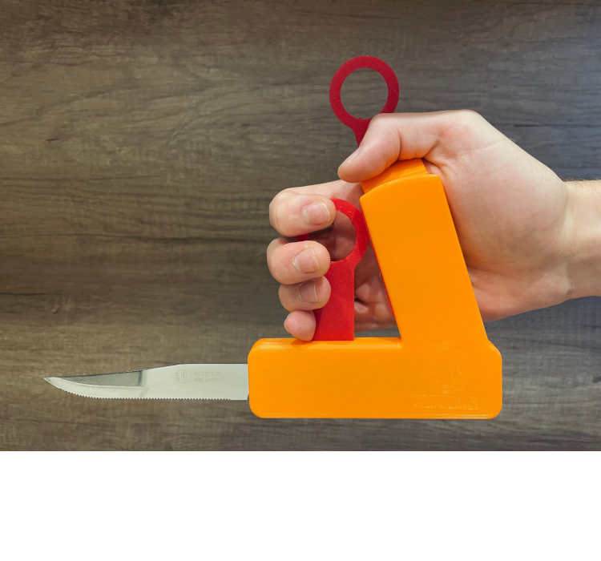
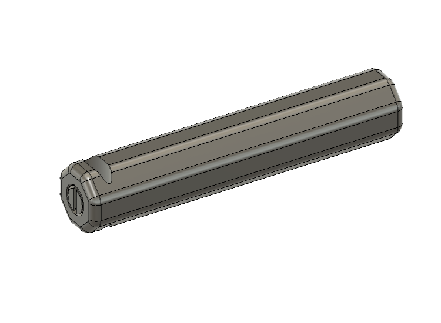

# Lista Modelli 3D

**Per scaricare il o i modelli, premere direttamente sull'immagine a sinistra.**

I seguenti presidi sono stati realizzati grazie all'aiuto di tutti i terapisti delle unità spinali che hanno partecipato al progetto.

## Lista Presidi Modificabili

---

[][file_adattatore_joystick] 

### Adattatore per joystick carrozzina motorizzata:

Per questo progetto sono state usate delle **viti da legno 3,00x20 mm**.

#### Modalità di stampa:

Usare le impostazioni standard di stampa con un **altezza layer di 0,2 mm** (per fare più veloce si può anche stampare con layer 0,28 mm).

 

- **"Base"** --> stamparla a testa in giù, non necessita di supporti.
- **"Pezzo Interno"** --> stamparlo con la superficie piatta a contatto con il piano, **necessita di supporti**.
- **"Poggiamano"** --> stamparlo in verticale.
- **"Spondine"** --> stamparle in orizzontale con la faccia senza raccordi a contatto con il piano di stampa.

#### Design e Ingegnerizzazione:

- Maurizio Contu  (maurizio.contu@hackability.it)

#### Collaboratori:

- Marco Bocca (marco.bocca94@gmail.com)
- Giuseppe Becci (peppinobecci@gmail.com)

#### Cartella file stl:

[Cartella_STL](experimental/Adattatore_Joystick/stl).

#### Progetto PrusaSlicer:

[Progetto PrusaSlicer ottimizzato per ELEGOO Neptune 3 PRO](experimental/Adattatore_Joystick/progetto_prusaslicer/adattatore_joystick-elegoo_neptune-3_pro.3mf?raw=true)

[Progetto PrusaSlicer ottimizzato per Creality Ender 3 V2](experimental/Adattatore_Joystick/progetto_prusaslicer/adattatore_joystick-creality_ender3-V2.3mf?raw=true)

[Progetto PrusaSlicer ottimizzato per DELTACOMB DC20](experimental/Adattatore_Joystick/progetto_prusaslicer/adattatore_joystick-deltacomb_DC20.3mf?raw=true)

Attenzione: mettere questo file nella stessa cartella dei modelli stl.

 

---

[][file_aattaccabottoni] 
### Attaccabottoni:

Per questo progetto è stato usato del **fil di ferro spessore 2 mm**.

#### Modalità di stampa:

Usare le impostazioni standard di stampa con un **altezza layer di 0,2 mm** (per fare più veloce si può anche stampare con layer 0,28 mm).

- **"Manico"** --> stamparlo orizzontalmente, **necessita di supporti**.
- **"Incastro"** --> stamparlo verticalmente, non necessita di supporti.

#### Design:

- Giulia Galante  (giuliag.galante@gmail.com)
- Simone De Pascalis (simodidepa@gmail.com)
- Francesco Rodighiero (francesco.rodighiero@gmail.com)

#### Ingegnerizzazione:

- Maurizio Contu (maurizio.contu@hackability.it)

#### Collaboratori:

- Marco Bocca (marco.bocca94@gmail.com)
- Giuseppe Becci (peppinobecci@gmail.com)

#### Cartella file stl:

[Cartella_STL](experimental/Attaccabottoni/stl).

#### Progetto PrusaSlicer:

[Progetto PrusaSlicer ottimizzato per ELEGOO Neptune 3 PRO](experimental/Attaccabottoni/progetto_prusaslicer/attaccabottoni-elegoo_neptune-3_pro.3mf?raw=true)

[Progetto PrusaSlicer ottimizzato per Creality Ender 3 V2](experimental/Attaccabottoni/progetto_prusaslicer/attaccabottoni-creality_ender3-V2.3mf?raw=true)

[Progetto PrusaSlicer ottimizzato per DELTACOMB DC20](experimental/Attaccabottoni/progetto_prusaslicer/attaccabottoni-deltacomb_DC20.3mf?raw=true)

Attenzione: mettere questo file nella stessa cartella dei modelli stl.

 

---

[][file_joystick_originale] 
### Joystick Originale:

#### Modalità di stampa:

Usare le impostazioni standard di stampa con un **altezza layer di 0,2 mm** (per fare più veloce si può anche stampare con layer 0,28 mm).

Stampare verticalmente con l'incastro rivolto al piano di stampa, **necessita di supporti**.

 

#### Design e Ingegnerizzazione:

- Maurizio Contu  (maurizio.contu@hackability.it)

#### Collaboratori:

- Marco Bocca (marco.bocca94@gmail.com)
- Giuseppe Becci (peppinobecci@gmail.com)

#### Cartella file stl:

[Cartella_STL](experimental/Joystick_originale/stl).

#### Progetto PrusaSlicer:

[Progetto PrusaSlicer ottimizzato per ELEGOO Neptune 3 PRO](experimental/Joystick_originale/progetto_prusaslicer/joystick-elegoo_neptune-3_pro.3mf?raw=true)

[Progetto PrusaSlicer ottimizzato per Creality Ender 3 V2](experimental/Joystick_originale/progetto_prusaslicer/joystick-creality_ender3-V2.3mf?raw=true)

[Progetto PrusaSlicer ottimizzato per DELTACOMB DC20](experimental/Joystick_originale/progetto_prusaslicer/joystick-deltacomb_DC20.3mf?raw=true)

Attenzione: mettere questo file nella stessa cartella dei modelli stl.

 

---

[][file_joystick_sfera] 
### Joystick Sfera:

#### Modalità di stampa:

Usare le impostazioni standard di stampa con un **altezza layer di 0,2 mm** (per fare più veloce si può anche stampare con layer 0,28 mm).

Stampare verticalmente con l'incastro rivolto al piano di stampa, il modello è ottimizzato per essere stampato **senza supporti**.

 

#### Design e Ingegnerizzazione:

- Maurizio Contu  (maurizio.contu@hackability.it)

#### Collaboratori:

- Marco Bocca (marco.bocca94@gmail.com)
- Giuseppe Becci (peppinobecci@gmail.com)

#### Cartella file stl:

[Cartella_STL](experimental/Joystick_Sfera/stl).

#### Progetto PrusaSlicer:

[Progetto PrusaSlicer ottimizzato per ELEGOO Neptune 3 PRO](experimental/Joystick_Sfera/progetto_prusaslicer/joystick_sfera-elegoo_neptune-3_pro.3mf?raw=true)

[Progetto PrusaSlicer ottimizzato per Creality Ender 3 V2](experimental/Joystick_Sfera/progetto_prusaslicer/joystick_sfera-creality_ender3-V2.3mf?raw=true)

[Progetto PrusaSlicer ottimizzato per DELTACOMB DC20](experimental/Joystick_Sfera/progetto_prusaslicer/joystick_sfera-deltacomb_DC20.3mf?raw=true)

Attenzione: mettere questo file nella stessa cartella dei modelli stl.

 

---

[][file_joystick_ver2] 
### Joystick Versione 2:

#### Modalità di stampa:

Usare le impostazioni standard di stampa con un **altezza layer di 0,2 mm** (per fare più veloce si può anche stampare con layer 0,28 mm).

Stampare verticalmente con l'incastro rivolto al piano di stampa, il modello è ottimizzato per essere stampato **senza supporti**.

 

#### Design e Ingegnerizzazione:

- Maurizio Contu  (maurizio.contu@hackability.it)

#### Collaboratori:

- Marco Bocca (marco.bocca94@gmail.com)
- Giuseppe Becci (peppinobecci@gmail.com)

#### Cartella file stl:

[Cartella_STL](experimental/Joystick_Ver2/stl).

#### Progetto PrusaSlicer:

[Progetto PrusaSlicer ottimizzato per ELEGOO Neptune 3 PRO](experimental/Joystick_Ver2/progetto_prusaslicer/joystick_ver2-elegoo_neptune-3_pro.3mf?raw=true)

[Progetto PrusaSlicer ottimizzato per Creality Ender 3 V2](experimental/Joystick_Ver2/progetto_prusaslicer/joystick_ver2-creality_ender3-V2.3mf?raw=true)

[Progetto PrusaSlicer ottimizzato per DELTACOMB DC20](experimental/Joystick_Ver2/progetto_prusaslicer/joystick_ver2-deltacomb_DC20.3mf?raw=true)

Attenzione: mettere questo file nella stessa cartella dei modelli stl.

 

---

[][file_portaspazzola] 
### Portaspazzola:

#### Modalità di stampa:

Usare le impostazioni standard di stampa con un **altezza layer di 0,2 mm** (per fare più veloce si può anche stampare con layer 0,28 mm).

- **"Manico"** --> stamparlo orizzontalmente, **necessita di supporti ovunque**.
- **"Portaspazzola"** --> stamparlo con la pinza per la spazzola orientata verticalmente,  **necessita di supporti solo dal piano di stampa**.

 

#### Design:

- Giulia Galante  (giuliag.galante@gmail.com)
- Simone De Pascalis (simodidepa@gmail.com)
- Francesco Rodighiero (francesco.rodighiero@gmail.com)

#### Ingegnerizzazione:

- Maurizio Contu (maurizio.contu@hackability.it)

#### Collaboratori:

- Marco Bocca (marco.bocca94@gmail.com)
- Giuseppe Becci (peppinobecci@gmail.com)

#### Cartella file stl:

[Cartella_STL](experimental/Portaspazzola/stl).

#### Progetto PrusaSlicer:

[Progetto PrusaSlicer ottimizzato per ELEGOO Neptune 3 PRO](experimental/Portaspazzola/progetto_prusaslicer/portaspazzola-elegoo_neptune-3_pro.3mf?raw=true)

[Progetto PrusaSlicer ottimizzato per Creality Ender 3 V2](experimental/Portaspazzola/progetto_prusaslicer/portaspazzola-creality_ender3-V2.3mf?raw=true)

[Progetto PrusaSlicer ottimizzato per DELTACOMB DC20](experimental/Portaspazzola/progetto_prusaslicer/portaspazzola-deltacomb_DC20.3mf?raw=true)

Attenzione: mettere questo file nella stessa cartella dei modelli stl.

 

---

[][file_presidio_dito] 
### Presidio Dito:

#### Modalità di stampa:

Usare le impostazioni standard di stampa con un **altezza layer di 0,2 mm** e **100% Riempimento**.

**Stampare orizzontalmente**, il modello **necessita di supporti generati solo dal piano di stampa**.

 

#### Design e Ingegnerizzazione:

- Maurizio Contu  (maurizio.contu@hackability.it)

#### Collaboratori:

- Marco Bocca (marco.bocca94@gmail.com)
- Giuseppe Becci (peppinobecci@gmail.com)

#### Cartella file stl:

[Cartella_STL](experimental/Presidio_Dito/stl).

#### Progetto PrusaSlicer:

[Progetto PrusaSlicer ottimizzato per ELEGOO Neptune 3 PRO](experimental/Presidio_Dito/progetto_prusaslicer/presidio_dito-elegoo_neptune-3_pro.3mf?raw=true)

[Progetto PrusaSlicer ottimizzato per Creality Ender 3 V2](experimental/Presidio_Dito/progetto_prusaslicer/presidio_dito-creality_ender3-V2.3mf?raw=true)

[Progetto PrusaSlicer ottimizzato per DELTACOMB DC20](experimental/Presidio_Dito/progetto_prusaslicer/presidio_dito-deltacomb_DC20.3mf?raw=true)

Attenzione: mettere questo file nella stessa cartella dei modelli stl.

 

---

[][file_presidio_falange]
### Presidio Falange:

#### Modalità di stampa:

Usare le impostazioni standard di stampa con un **altezza layer di 0,2 mm** e **100% Riempimento**.

**Stampare verticalmente con la punta rivolta verso il basso** a contatto con il piano di stampa, **necessita di supporti generati solo dal piano di stampa**.

 

#### Design e Ingegnerizzazione:

- Maurizio Contu  (maurizio.contu@hackability.it)

#### Collaboratori:

- Marco Bocca (marco.bocca94@gmail.com)
- Giuseppe Becci (peppinobecci@gmail.com)

#### Cartella file stl:

[Cartella_STL](experimental/Presidio_Falange/stl).

#### Progetto PrusaSlicer:

[Progetto PrusaSlicer ottimizzato per ELEGOO Neptune 3 PRO](experimental/Presidio_Falange/progetto_prusaslicer/presidio_falange-elegoo_neptune-3_pro.3mf?raw=true)

[Progetto PrusaSlicer ottimizzato per Creality Ender 3 V2](experimental/Presidio_Falange/progetto_prusaslicer/presidio_falange-creality_ender3-V2.3mf?raw=true)

[Progetto PrusaSlicer ottimizzato per DELTACOMB DC20](experimental/Presidio_Falange/progetto_prusaslicer/presidio_falange-deltacomb_DC20.3mf?raw=true)

Attenzione: mettere questo file nella stessa cartella dei modelli stl.

 

---

[][file_prolunga_freni] 
### Prolunga Freni:

#### Modalità di stampa:

Usare le impostazioni standard di stampa con un **altezza layer di 0,2 mm** (per fare più veloce si può anche stampare con layer 0,28 mm), aumentando solo il **numero di perimetri a 4** e un **Riempimento al 15% o 20%**.

**Stampare orizzontalmente** con la superficie a contatto col piano di stampa, il modello è ottimizzato per essere stampato **senza supporti**..

 

#### Design e Ingegnerizzazione:

- Maurizio Contu  (maurizio.contu@hackability.it)

#### Collaboratori:

- Marco Bocca (marco.bocca94@gmail.com)
- Giuseppe Becci (peppinobecci@gmail.com)

#### Cartella file stl:

[Cartella_STL](experimental/Prolunga_Freni/stl).

#### Progetto PrusaSlicer:

[Progetto PrusaSlicer ottimizzato per ELEGOO Neptune 3 PRO](experimental/Prolunga_Freni/progetto_prusaslicer/prolunga_freni-elegoo_neptune-3_pro.3mf?raw=true)

[Progetto PrusaSlicer ottimizzato per Creality Ender 3 V2](experimental/Prolunga_Freni/progetto_prusaslicer/prolunga_freni-creality_ender3-V2.3mf?raw=true)

[Progetto PrusaSlicer ottimizzato per DELTACOMB DC20](experimental/Prolunga_Freni/progetto_prusaslicer/prolunga_freni-deltacomb_DC20.3mf?raw=true)

Attenzione: mettere questo file nella stessa cartella dei modelli stl.

 

---

[file_adattatore_joystick]: presidi_ingegnerizzati/Adattatore_Joystick_rev_1.4.f3d?raw=true
[file_aattaccabottoni]: presidi_ingegnerizzati/Attaccabottoni_rev_1.0.f3d?raw=true
[file_joystick_originale]: presidi_ingegnerizzati/Joystick_originale.f3d?raw=true
[file_joystick_sfera]: presidi_ingegnerizzati/Joystick_sfera_rev_1.0.f3d?raw=true
[file_portaspazzola]: presidi_ingegnerizzati/Portaspazzola_rev_1.0.f3d?raw=true
[file_presidio_dito]: presidi_ingegnerizzati/Presidio_dito_ver_1.1.f3d?raw=true
[file_prolunga_freni]: presidi_ingegnerizzati/Prolunga_freni_rev_1.1.f3d?raw=true
[file_presidio_falange]: presidi_ingegnerizzati/Presidio_falange_rev_1.2.f3d?raw=true
[file_joystick_ver2]: presidi_ingegnerizzati/Joystick_ver2_rev_1.2.f3d?raw=true

## Lista Modelli Non Modificabili:

I presidi in questa lista sono già in stl, vanno direttamente importati su Prusa Slicer e poi vanno divisi con il pulsante **Dividi in oggetti** che trovate in alto nella barra ozizzontale.
<!--I presidi in questa lista bisogna sempre aprirli con Autodesk Fusion 360 ed esportare direttamente i corpi in stl. -->

---

[][file_estensione_tagliaunghie] 
### Estensione Per Tagliaunghe Rev: 2.0:

<!-- #### Modalità di stampa: -->

#### Design Rev 2.0:

- Simone De Pascalis (simodidepa@gmail.com)

#### Cartella file stl:

[Cartella_STL](presidi_non_modificabili/estensione_tagli_unghie/stl).

 

#### Progetto PrusaSlicer (Experimental):

[Progetto PrusaSlicer ottimizzato per ELEGOO Neptune 3 PRO](presidi_non_modificabili/estensione_tagli_unghie/progetto_prusaslicer/estensione_tagli_unghie-elegoo_neptune-3_pro.3mf?raw=true)

[Progetto PrusaSlicer ottimizzato per Creality Ender 3 V2](presidi_non_modificabili/estensione_tagli_unghie/progetto_prusaslicer/estensione_tagli_unghie-creality_ender3-V2.3mf?raw=true)

[Progetto PrusaSlicer ottimizzato per DELTACOMB DC20](presidi_non_modificabili/estensione_tagli_unghie/progetto_prusaslicer/estensione_tagli_unghie-deltacomb_DC20.3mf?raw=true)

Tips: Spostare fuori dal piano di stampa i pezzi che NON si desidera vengano stampati.

Attenzione: mettere questo file nella stessa cartella dei modelli stl.

#### Design prima versione:

- Giulia Galante  (giuliag.galante@gmail.com)
- Simone De Pascalis (simodidepa@gmail.com)
- Francesco Rodighiero (francesco.rodighiero@gmail.com)

 

---

[][file_tutore_penna] 
### Tutore Penna Rev: 2.0:

<!-- #### Modalità di stampa: -->

#### Design Rev 2.0:

- Simone De Pascalis (simodidepa@gmail.com)

#### Cartella file stl:

[Cartella_STL](presidi_non_modificabili/tutore_penna/stl).

 

#### Progetto PrusaSlicer (Experimental):

[Progetto PrusaSlicer ottimizzato per ELEGOO Neptune 3 PRO](presidi_non_modificabili/tutore_penna/progetto_prusaslicer/tutore_penna-elegoo_neptune-3_pro.3mf?raw=true)

[Progetto PrusaSlicer ottimizzato per Creality Ender 3 V2](presidi_non_modificabili/tutore_penna/progetto_prusaslicer/tutore_penna-creality_ender3-V2.3mf?raw=true)

[Progetto PrusaSlicer ottimizzato per DELTACOMB DC20](presidi_non_modificabili/tutore_penna/progetto_prusaslicer/tutore_penna-deltacomb_DC20.3mf?raw=true)

Tips: Spostare fuori dal piano di stampa i pezzi che NON si desidera vengano stampati.

Attenzione: mettere questo file nella stessa cartella dei modelli stl.

#### Design prima versione:

- Giulia Galante  (giuliag.galante@gmail.com)
- Simone De Pascalis (simodidepa@gmail.com)
- Francesco Rodighiero (francesco.rodighiero@gmail.com)

 

---

[][file_hacknife]
### Cut it - Hacknife:

#### Video Dimostrazione:

[LINK VIDEO](https://www.facebook.com/watch/?v=874888290203762)

 

#### Design:

- Sara Modugno (https://www.linkedin.com/in/sara-modugno-b87384229/)
- Marco Bocca (marco.bocca94@gmail.com)
- Davide Massetti (https://www.linkedin.com/in/davide-massetti-368037211/)

#### Cartella file stl:

[Cartella_STL](presidi_non_modificabili/hacknife/stl).

#### Avvertenze:

Affinchè venga garantito il funzionamento il progetto presenta le seguenti parti sono da **stampare in TPU**:

- tappo_corto.stl
- tappo_lungo.stl
- laccio_corto.stl
- laccio_lungo.stl

**La stampante ELEGOO Neptune 3 PRO è l'unica stampante idonea per questo materiale pertanto solo per questa sono stati inseriti i progetti prusaslicer per hacknife.**

#### Progetto PrusaSlicer (Experimental):

[SOLO_CORPO_Progetto PrusaSlicer ottimizzato per ELEGOO Neptune 3 PRO](https://github.com/HackabilityNPO/Tech4Inclusion/raw/main/Presidi/presidi_non_modificabili/hacknife/progetto_prusaslicer/corpo_hacknife-elegoo_neptune-3_pro.3mf)

[PARTI_IN_GOMMA_Progetto PrusaSlicer ottimizzato per ELEGOO Neptune 3 PRO](https://github.com/HackabilityNPO/Tech4Inclusion/raw/main/Presidi/presidi_non_modificabili/hacknife/progetto_prusaslicer/rubber_hacknife-elegoo_neptune-3_pro.3mf)

<!--[SOLO_CORPO_Progetto PrusaSlicer ottimizzato per Creality Ender 3 V2](presidi_non_modificabili/hacknife/progetto_prusaslicer/corpo_hacknife-creality_ender3-V2.3mf?raw=true) -->

<!--[SOLO_CORPO_Progetto PrusaSlicer ottimizzato per DELTACOMB DC20](presidi_non_modificabili/hacknife/progetto_prusaslicer/corpo_hacknife-deltacomb_DC20.3mf?raw=true) -->

Tips: Spostare fuori dal piano di stampa i pezzi che NON si desidera vengano stampati.

Attenzione: mettere questo file nella stessa cartella dei modelli stl.

 

---

## Lista Modelli sperimentali:

I presidi in questa lista sono sperimentali, sono forniti sia con il file f3d e sia in stl.
<!--I presidi in questa lista bisogna sempre aprirli con Autodesk Fusion 360 ed esportare direttamente i corpi in stl. -->

---

[][file_supporto_cucchiaio]
### Supporto per cucchiaio:

<!-- #### Modalità di stampa: -->

#### Design e Ingegnerizzazione:

- Maurizio Contu  (maurizio.contu@hackability.it)

#### Cartella file stl:

[Cartella_STL](experimental/supporto_cucchiaio/stl).

 

#### Progetto PrusaSlicer:

[Progetto PrusaSlicer ottimizzato per ELEGOO Neptune 3 PRO](experimental/supporto_cucchiaio/progetto_prusaslicer/supporto_cucchiaio-elegoo_neptune-3_pro.3mf?raw=true "download")

[Progetto PrusaSlicer ottimizzato per Creality Ender 3 V2](experimental/supporto_cucchiaio/progetto_prusaslicer/supporto_cucchiaio-creality_ender3-V2.3mf?raw=true "download")

[Progetto PrusaSlicer ottimizzato per DELTACOMB DC20](experimental/supporto_cucchiaio/progetto_prusaslicer/supporto_cucchiaio-deltacomb_DC20.3mf?raw=true "download")

Attenzione: mettere questo file nella stessa cartella dei modelli stl.

 

---

## Profili PrusaSlicer:

Di seguito i profili per l'aggiunta delle stampanti sul programma PrusaSlicer

### Profilo per Deltacomb DC-20:

[DELTACOMB DC-20](/Configurazione_Prusaslicer/PrusaSlicer_config_deltacomb_DC-20.ini?raw=true)

---

[file_hacknife]: presidi_non_modificabili/hacknife/copertina/hacknife_rev.1.0.stl?raw=true
[file_estensione_tagliaunghie]: presidi_non_modificabili/estensione_tagli_unghie/copertina/estensione_tagliaunghie_rev.2.0.stl?raw=true
[file_tutore_penna]: presidi_non_modificabili/tutore_penna/copertina/tutore_penna_rev.2.0.stl?raw=true
[file_supporto_cucchiaio]:experimental/supporto_cucchiaio/f3d/supporto_cuccuiaio.f3d?raw=true
<!-- [adattatore_joystick]: anteprime_presidi/adattatore_joystick.png -->
