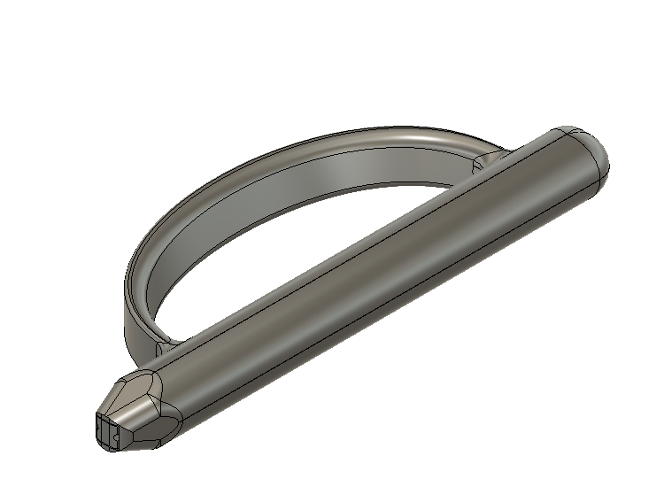
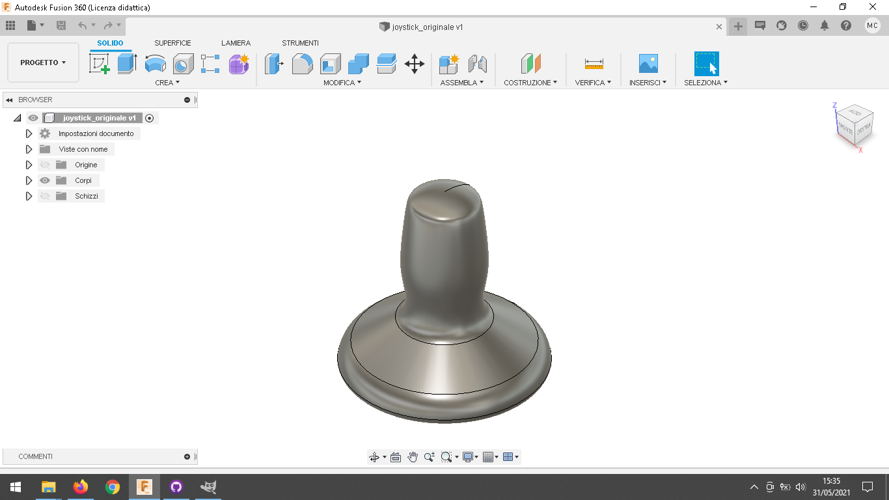
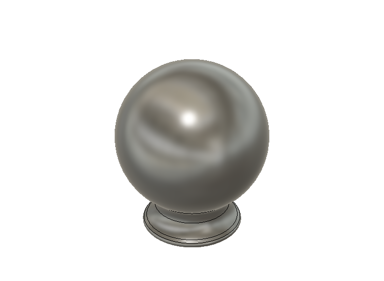
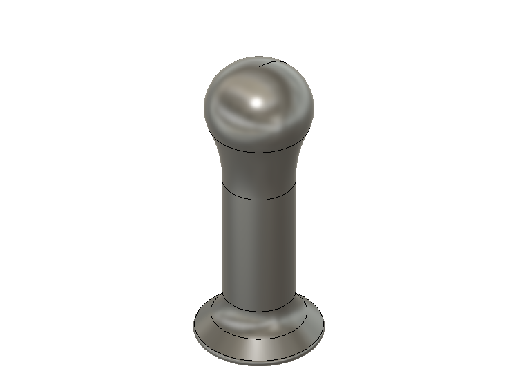
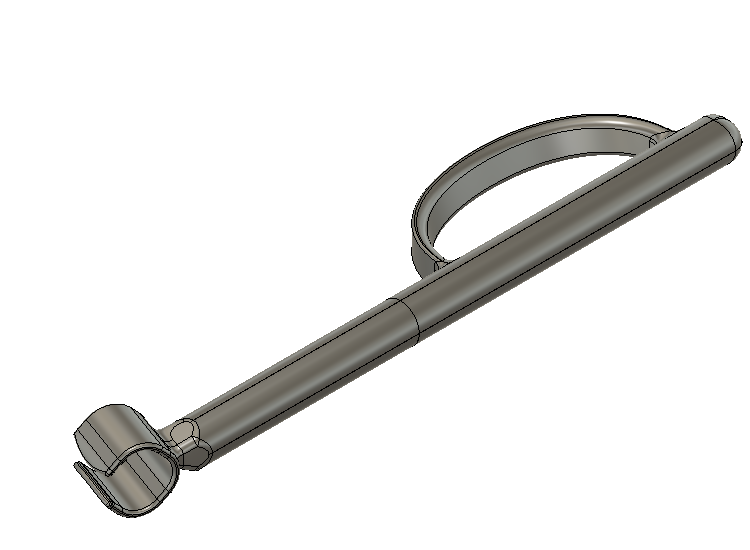
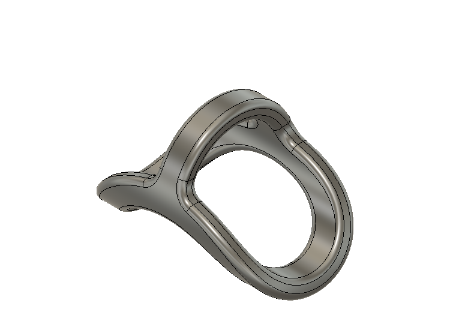
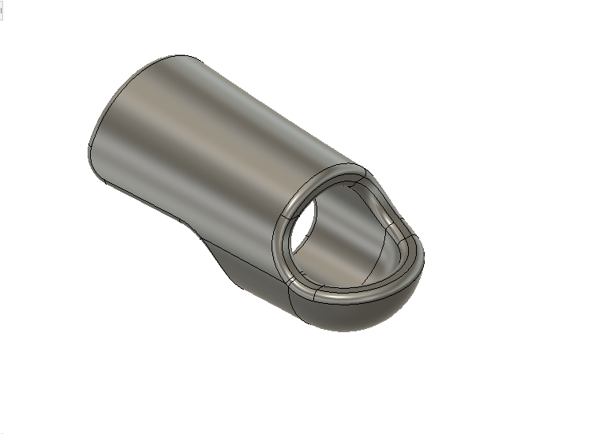
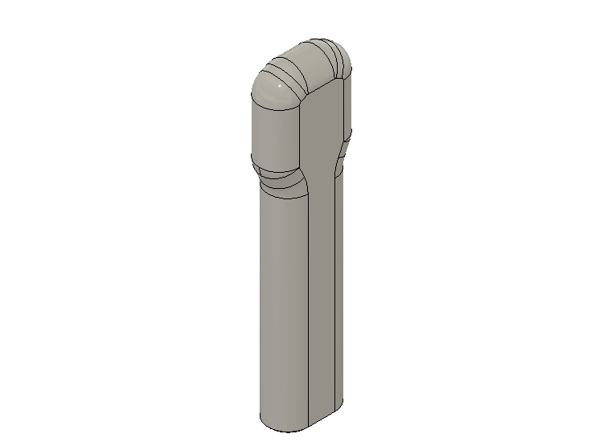
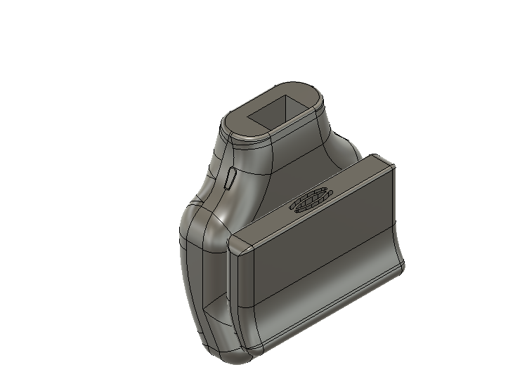
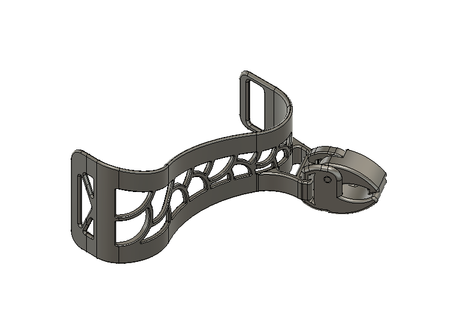

# Lista Modelli 3D

**Per scaricare il o i modelli, premere direttamente sull'immagine a sinistra.**

I seguenti presidi sono stati realizzati grazie all'aiuto di tutti i terapisti delle unità spinali che hanno partecipato al progetto.

## Lista Presidi Modificabili

---

[][file_adattatore_joystick] 
### Adattatore per joystick carrozzina motorizzata:

Per questo progetto sono state usate delle **viti da legno 3,00x20 mm**.

#### Modalità di stampa:

Usare le impostazioni standard di stampa con un **altezza layer di 0,2 mm** (per fare più veloce si può anche stampare con layer 0,28 mm).

- **"Base"** --> stamparla a testa in giù, non necessita di supporti.
- **"Pezzo Interno"** --> stamparlo con la superficie piatta a contatto con il piano, **necessita di supporti**.
- **"Poggiamano"** --> stamparlo in verticale.
- **"Spondine"** --> stamparle in orizzontale con la faccia senza raccordi a contatto con il piano di stampa.

#### Progetto di:

- Maurizio Contu  (maurizio.contu@hackability.it)

 

---

[][file_aattaccabottoni] 
### Attaccabottoni:
Per questo progetto è stato usato del **fil di ferro spessore 2 mm**.

#### Modalità di stampa:

Usare le impostazioni standard di stampa con un **altezza layer di 0,2 mm** (per fare più veloce si può anche stampare con layer 0,28 mm).

- **"Manico"** --> stamparlo orizzontalmente, **necessita di supporti**.
- **"Incastro"** --> stamparlo verticalmente, non necessita di supporti.

#### Progetto di:

- Giulia Galante  (giuliag.galante@gmail.com)
- Simone De Pascalis (simodidepa@gmail.com)
- Francesco Rodighiero (francesco.rodighiero@gmail.com)
- (Ingegnerizzazione e revisione) Maurizio Contu  (maurizio.contu@hackability.it)

 

---

[][file_joystick_originale] 
### Joystick Originale:

#### Modalità di stampa:

Usare le impostazioni standard di stampa con un **altezza layer di 0,2 mm** (per fare più veloce si può anche stampare con layer 0,28 mm).

Stampare verticalmente con l'incastro rivolto al piano di stampa, **necessita di supporti**.

#### Progetto di:

- Maurizio Contu  (maurizio.contu@hackability.it)

 

---

[][file_joystick_sfera] 
### Joystick Sfera:

#### Modalità di stampa:

Usare le impostazioni standard di stampa con un **altezza layer di 0,2 mm** (per fare più veloce si può anche stampare con layer 0,28 mm).

Stampare verticalmente con l'incastro rivolto al piano di stampa, il modello è ottimizzato per essere stampato **senza supporti**.

#### Progetto di:

- Maurizio Contu  (maurizio.contu@hackability.it)

 

---

[][file_joystick_ver2] 
### Joystick Versione 2:

#### Modalità di stampa:

Usare le impostazioni standard di stampa con un **altezza layer di 0,2 mm** (per fare più veloce si può anche stampare con layer 0,28 mm).

Stampare verticalmente con l'incastro rivolto al piano di stampa, il modello è ottimizzato per essere stampato **senza supporti**.

#### Progetto di:

- Maurizio Contu  (maurizio.contu@hackability.it)

 

---

[][file_portaspazzola] 
### Portaspazzola:

Usare le impostazioni standard di stampa con un **altezza layer di 0,2 mm** (per fare più veloce si può anche stampare con layer 0,28 mm).

#### Modalità di stampa:

#### Progetto di:

- Giulia Galante  (giuliag.galante@gmail.com)
- Simone De Pascalis (simodidepa@gmail.com)
- Francesco Rodighiero (francesco.rodighiero@gmail.com)
- (Ingegnerizzazione e revisione) Maurizio Contu  (maurizio.contu@hackability.it)

 

---

[][file_presidio_dito] 
### Presidio Dito:

#### Modalità di stampa:

#### Progetto di:

- Maurizio Contu  (maurizio.contu@hackability.it)

 

---

[][file_presidio_falange]
### Presidio Falange:

#### Modalità di stampa:

#### Progetto di:

- Maurizio Contu  (maurizio.contu@hackability.it)

 

---

[][file_prolunga_freni] 
### Prolunga Freni:

#### Modalità di stampa:

#### Progetto di:

- Maurizio Contu  (maurizio.contu@hackability.it)

 

---

[file_adattatore_joystick]: presidi_ingegnerizzati/Adattatore_Joystick_rev_1.4.f3d?raw=true
[file_aattaccabottoni]: presidi_ingegnerizzati/Attaccabottoni_rev_1.0.f3d?raw=true
[file_joystick_originale]: presidi_ingegnerizzati/Joystick_originale.f3d?raw=true
[file_joystick_sfera]: presidi_ingegnerizzati/Joystick_sfera_rev_1.0.f3d?raw=true
[file_portaspazzola]: presidi_ingegnerizzati/Portaspazzola_rev_1.0.f3d?raw=true
[file_presidio_dito]: presidi_ingegnerizzati/Presidio_dito_ver_1.1.f3d?raw=true
[file_prolunga_freni]: presidi_ingegnerizzati/Prolunga_freni_rev_1.1.f3d?raw=true
[file_presidio_falange]: presidi_ingegnerizzati/Presidio_falange_rev_1.2.f3d?raw=true
[file_joystick_ver2]: presidi_ingegnerizzati/Joystick_ver2_rev_1.2.f3d?raw=true

## Lista Modelli Non Modificabili:

I presidi in questa lista sono già in stl, vanno direttamente importati su Prusa Slicer e poi vanno divisi con il pulsante **Dividi in oggetti** che trovate in alto nella barra ozizzontale.
<!--I presidi in questa lista bisogna sempre aprirli con Autodesk Fusion 360 ed esportare direttamente i corpi in stl. -->

---

[][file_estensione_tagliaunghie] 
### Estensione Per Tagliaunghe:

#### Modalità di stampa:

#### Progetto di:

- Giulia Galante  (giuliag.galante@gmail.com)
- Simone De Pascalis (simodidepa@gmail.com)
- Francesco Rodighiero (francesco.rodighiero@gmail.com)

 

---

[][file_tutore_penna] 
### Tutore Penna:

#### Modalità di stampa:

#### Progetto di:

- Giulia Galante  (giuliag.galante@gmail.com)
- Simone De Pascalis (simodidepa@gmail.com)
- Francesco Rodighiero (francesco.rodighiero@gmail.com)

 

---

[file_estensione_tagliaunghie]: presidi_non_modificabili/estensione_tagliaunghie.stl?raw=true
[file_tutore_penna]: presidi_non_modificabili/tutore_penna.stl?raw=true

<!-- [adattatore_joystick]: anteprime_presidi/adattatore_joystick.png -->

